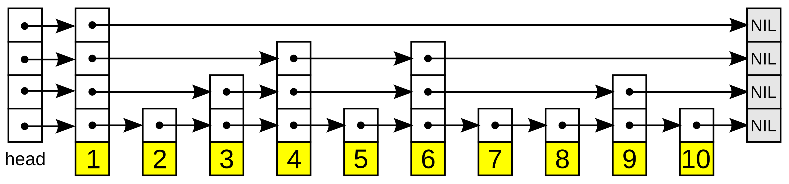
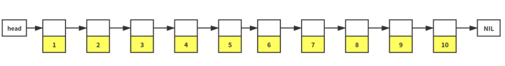
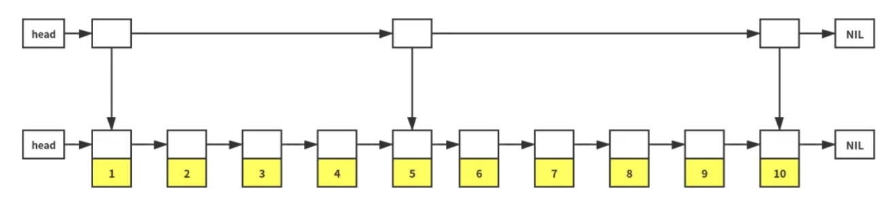
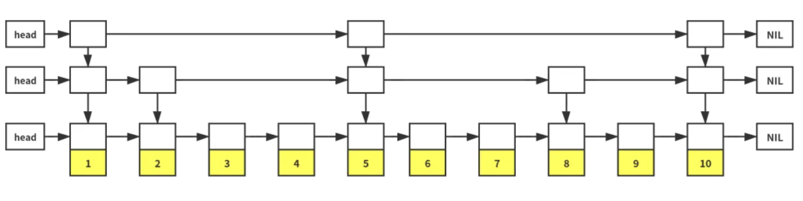

# Memtable
memtable是LsmTree架构中的内存结构，每次对于leveldb的读写操作都是先从memtable开始的，memtable在达到内存大小阈值时便会触发到immutable的转变，immutable是内存中的只读结构。关于memtable到immutable的转变以及后续的压缩操作都在后续的章节进行介绍。
1. memtable可以由多种数据结构组织，比较典型的有leveldb中使用的skiplist还有平衡树（如红黑树）。相比之下，skiplist的并发度更好，这点在接下来进行讨论。
2. 作为每次读写最先访问的memtable，其必须支持的功能便是add以及get。与此同时，为了便于内存管理，level db在memtable等多个内存结构中添加了引用Ref()方法，这里类似于shared_ptr的RAII性质，但是为什么没有真正使用智能指针是因为level db在C++11标准刚出来的时候发布，为了编译器的兼容性考虑。
3. level db中memtable使用skiplist并不是不可替代的。
```C++
typedef SkipList<const char*, KeyComparator> Table;
Table table_;
```
后续我准备添加红黑树作为memtable的数据结构并对比其并发度。

## Skiplist

图源wikipedia
Skip list 是一种可以用于替代查找树的内存数据结构，其基本原理是在一个有序的链表之上增加一些索引，通过一个随机规则（保证一定概率）来“模拟”二分查找。
对于skip list中每一个节点的高度都是随机的。正是这种随机性，铸就了skip list的高效的查询效率：通过从最高层节点开始查询，由于越高层的数据数量越少，所以可以跳过很多数据。  
以上图为例：
* 查找7: 1->4->6->7;
* 查找11: 1->4->6->9->nil
* 查找5.5: 1->4->5->查找失败

## Skip list原理 [1]

Skip list 的基础是一个有序的链表。但是因为链表在内存中是离散存储的，我们无法在一个有序链表上执行二分查找。

所以，我们决定在这个有序的链表上增加一层索引，用于将这个有序链表一分为二。通过第一层索引可以将查找量减少一半。


 同理，我们可以对左边的链表(1->2->3->4) 建一层索引，将左边一分为二。对右边的链表(6->7->8->9->10)也可以进行一样的操作。如此递归下去……

这样通过付出一些指针的开销，可以将有序链表的查找时间复杂度从 O(n) 降低到和二分查找一样的 O(logn)。

如果每次都要“精准地一分为二”，插入、删除某个节点的时候会可能会涉及到调整其它节点的指针索引高度。这会让逻辑变得复杂许多，就像红黑树插入、删除节点可能会涉及子树的“旋转”一样。

Skip list 放弃了精确控制每个节点的索引高度来实现“二分查找”，转而采用一个随机概率规则来确定一个节点的高度。这样，一个节点的插入和删除，只会和它的相邻节点有关，逻辑简单，并且修改范围非常有限（锁粒度可以做到很细），可以实现更高的并发。

要实现随机近似二分查找，我们需要保证一个高度为 h 的节点，有 1/2 的概率是高度为 h+1 的节点 ：

高度 >= 1 的节点概率为 1。
高度  >= 2 的节点概率为 1/2。
高度 >= 3 的节点概率为 1/4。
...
高度 >= h 的节点概率为 1 / 2^(h-1)。
更通用一点，假设一个高度为 h 的节点，有概率 p 是高度为 h+1 的节点。那么一个长度为 n 的 skip list，需要的指针数量为：
N = p^0 * n + p^1 * n + p^2 * n + ...  = n * (p^0 + p^1 + p^2 + ....) = n*(1-p^n) / (1 - p)
因为 p < 1，当 n 趋近无穷的时候，p^n 趋近于 0，因此 N = n/(1-p)。Skip list 的空间复杂度是 O(n)。

如果我们想节省内存空间，可以适当的调低 1/2 这个概率，比如 1/3、1/4，从而减少索引指针个数。

## level db中skip list的实现
### Node
Node是skip list中每个节点的结构体，其定义如下：
```C++
template <typename Key, class Comparator>
struct SkipList<Key, Comparator>::Node {
  explicit Node(const Key& k) : key(k) {}

  Key const key;

  // Accessors/mutators for links.  Wrapped in methods so we can
  // add the appropriate barriers as necessary.
  Node* Next(int n) {
    assert(n >= 0);
    // Use an 'acquire load' so that we observe a fully initialized
    // version of the returned Node.
    return next_[n].load(std::memory_order_acquire);
  }
  void SetNext(int n, Node* x) {
    assert(n >= 0);
    // Use a 'release store' so that anybody who reads through this
    // pointer observes a fully initialized version of the inserted node.
    next_[n].store(x, std::memory_order_release);
  }

  // No-barrier variants that can be safely used in a few locations.
  Node* NoBarrier_Next(int n) {
    assert(n >= 0);
    return next_[n].load(std::memory_order_relaxed);
  }
  void NoBarrier_SetNext(int n, Node* x) {
    assert(n >= 0);
    next_[n].store(x, std::memory_order_relaxed);
  }

 private:
  // Array of length equal to the node height.  next_[0] is lowest level link.
  std::atomic<Node*> next_[1];
};
```
这个next_数组是一个占位符，实际大小由内存分配【随机的高度】时决定。  
* ps:  
`std::memory_order_acquire`  
确保当前操作之后的所有操作在本线程中先于该操作执行，并且该操作对其他线程可见。
`std::memory_order_release`  
确保当前操作之前的所有操作在本线程中先于该操作执行，并且该操作对其他线程可见。  
`std::memory_order_relaxed`
没有任何同步或排序要求，只保证原子性操作。  
适用于不依赖顺序的独立操作，常用于计数器、标志位等。

根据`RandomHeight`的实现，LevelDB 将上面分析的每个元素高度增长的概率设置为 1/4，以节省内存。
```C++
template <typename Key, class Comparator>
int SkipList<Key, Comparator>::RandomHeight() {
  // Increase height with probability 1 in kBranching
  static const unsigned int kBranching = 4;
  int height = 1;
  while (height < kMaxHeight && rnd_.OneIn(kBranching)) {
    height++;
  }
  assert(height > 0);
  assert(height <= kMaxHeight);
  return height;
}
```

`FindGreaterOrEqual` 查找并返回第一个大于等于 key 的节点。如果是查找后需要进行插入，需要记录下这个节点的 prev 指针。
```C++
template <typename Key, class Comparator>
typename SkipList<Key, Comparator>::Node*
SkipList<Key, Comparator>::FindGreaterOrEqual(const Key& key, Node** prev) const {
  Node* x = head_;
  int level = GetMaxHeight() - 1;
  while (true) {
    Node* next = x->Next(level);
    if (KeyIsAfterNode(key, next)) {
      // Keep searching in this list
      x = next;
    } else {
      if (prev != nullptr) prev[level] = x;
      if (level == 0) {
        return next;
      } else {
        // Switch to next list
        level--;
      }
    }
  }
}
```

`Insert`插入一个 key。LevelDB 保证这里同一时刻只会有一个线程在写入，并通过原子地修改指针（SetNext）来保证不影响并发执行的读请求。
```c++
template <typename Key, class Comparator>
void SkipList<Key, Comparator>::Insert(const Key& key) {
  // TODO(opt): We can use a barrier-free variant of FindGreaterOrEqual()
  // here since Insert() is externally synchronized.
  Node* prev[kMaxHeight];
  Node* x = FindGreaterOrEqual(key, prev);

  // Our data structure does not allow duplicate insertion
  assert(x == nullptr || !Equal(key, x->key));

  int height = RandomHeight();
  if (height > GetMaxHeight()) {
    for (int i = GetMaxHeight(); i < height; i++) {
      prev[i] = head_;
    }
    // It is ok to mutate max_height_ without any synchronization
    // with concurrent readers.  A concurrent reader that observes
    // the new value of max_height_ will see either the old value of
    // new level pointers from head_ (nullptr), or a new value set in
    // the loop below.  In the former case the reader will
    // immediately drop to the next level since nullptr sorts after all
    // keys.  In the latter case the reader will use the new node.
    max_height_.store(height, std::memory_order_relaxed);
  }

  x = NewNode(key, height);
  for (int i = 0; i < height; i++) {
    // NoBarrier_SetNext() suffices since we will add a barrier when
    // we publish a pointer to "x" in prev[i].
    x->NoBarrier_SetNext(i, prev[i]->NoBarrier_Next(i));
    prev[i]->SetNext(i, x);
  }
}
```
* 由于levelDB的写入是单线程操作的【prev[i]->NoBarrier_Next(i)不会被修改】，而x又是新申请的节点【x的next不会被修改】，所以对`x`的修改可以不使用内存屏障。  
* 而对于prev[i]可能有线程在读，则采取内存屏障保证同步。
## 参考内容
1. [LevelDB 完全解析（1）：MemTable](https://mp.weixin.qq.com/s?__biz=MzI0NjA1MTU5Ng==&mid=2247483809&idx=1&sn=d43a8acec33d52f2c0182651f27e709b&chksm=e94467c2de33eed4a09017a1971670529e6e01c447fc596c86b822af8fb52a51f11ac0dbf43c&scene=178&cur_album_id=1342947967103352833#rd)